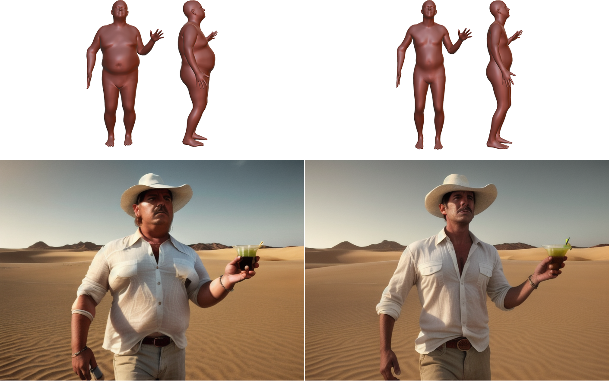

<div align="center">

# Controlling Human Shape and Pose in Text-to-Image Diffusion Models via Domain Adaptation

### Benito Buchheim, Max Reimann, Jürgen Döllner
*Hasso Plattner Institute, University of Potsdam*

</div>

---

Welcome to the official code repository for our paper:

**"Controlling Human Shape and Pose in Text-to-Image Diffusion Models via Domain Adaptation"**

In this repository, we provide the implementation to control human shape and pose in pretrained text-to-image diffusion models using a 3D human parametric model (SMPL). This includes our domain adaptation technique that maintains visual fidelity while providing fine-grained control over human appearance.


<div align="center">
🔗 <a href="https://ivpg.github.io/humanLDM">Project Page</a>
📃 <a href="https://arxiv.org/abs/2411.04724">Arxiv</a>
</div>

---


### Abstract
We present a methodology for conditional control of human shape and pose in pretrained text-to-image diffusion models using a 3D human parametric model (SMPL). Fine-tuning these diffusion models to adhere to new conditions requires large datasets and high-quality annotations, which can be more cost-effectively acquired through synthetic data generation rather than real-world data. However, the domain gap and low scene diversity of synthetic data can compromise the pretrained model's visual fidelity. We propose a domain-adaptation technique that maintains image quality by isolating synthetically trained conditional information in the classifier-free guidance vector and composing it with another control network to adapt the generated images to the input domain. To achieve SMPL-control, we fine-tune a ControlNet-based architecture on the synthetic SURREAL dataset of rendered humans and apply our domain adaptation at generation time. Experiments demonstrate that our model achieves greater shape and pose diversity than the 2D pose-based ControlNet, while maintaining the visual fidelity and improving stability, proving its usefulness for downstream tasks such as human animation.

## Table of Contents
- [Installation](#installation)
- [Model Setup](#model-setup)
- [Running Sample Inference](#running-sample-inference)
- [Training](#training)
- [Citation](#citation)

---

## Installation

1. **Clone the Repository**
   ```bash
   git clone https://github.com/benbuc/HumanLDMControl.git
   cd HumanLDMControl
   ```

2. **Set Up Conda Environment**
   Ensure you have Conda installed. Then, run:
   ```bash
   conda env create -f environment.yaml
   conda activate humanLDM
   ```

---

## Model Setup

1. **Download the Pretrained Model**  
   Download the model from [this link](https://drive.google.com/file/d/1r9W1GeO4iUVYD1fNWyEjI36ODpbfPL2e/view?usp=sharing) and extract it to the `checkpoints/` directory.:
   ```bash
   cd checkpoints/
   gdown 1r9W1GeO4iUVYD1fNWyEjI36ODpbfPL2e -O attribute_guidance.zip
   unzip attribute_guidance.zip
   ```

2. **Check Directory Structure**  
   Ensure the extracted files are in the following structure:
   ```
   checkpoints/
    └── attribute_guidance/
        ├── controlnet/
        │   └── ...
        └── smpl_embedder/
            └── ...
   ```

---

## Running Sample Inference

We compiled a very basic sample script on how to run inference using our pretrained model. To run the script, execute the following command:

```bash
python run_sample_inference.py
```

This will reconstruct the teaser images from our paper to the file `sample_output.png`.

The following command will run the shape-controlled version of AnimateDiff:
```bash
python run_sample_inference_animated.py
```

---

## Training

After setting up the environment (see above), you can train the model using the provided training script `run_train.sh`.
The training script `train.py` is directly adapted from the [Huggingface ControlNet guide](https://huggingface.co/blog/train-your-controlnet). The original file can be downloaded [here](https://github.com/huggingface/diffusers/blob/main/examples/controlnet/train_controlnet.py).

### Download Dataset
Download the SURREAL dataset: [https://www.di.ens.fr/willow/research/surreal/](https://www.di.ens.fr/willow/research/surreal/)

Unpack the dataset into a folder `SURREAL/` in the root directory of this repository.
```bash
cd HumanLDMControl/
tar -xvf SURREAL_v1.tar.gz -C SURREAL
```

The resulting folder structure should look like this:
```
HumanLDMControl/
├── checkpoints/
│   └── ...
└── SURREAL/
    └── cmu/
        └── ...
```

Download our OpenPose annotations for the dataset from [this link](https://drive.google.com/file/d/1-1IAC0oNvSN_bSM6EfXPSVRck0iFV1Qs/view?usp=sharing) and unpack in the `SURREAL/`directory.
```bash
cd SURREAL/
gdown 1-1IAC0oNvSN_bSM6EfXPSVRck0iFV1Qs -O surreal_openpose.zip
unzip surreal_openpose.zip
cd ..
```

### Dataset preparation
The file `surreal.py` holds a custom `datasets` class for SURREAL.
Run the file once to let `datasets` load the dataset and store it in the cache.
```bash
python surreal.py
```
This will take a while (1605030 samples), but after reading the dataset once, it can be quickly loaded using the `load_dataset("surreal")` function from the `datasets` library.


### Running Training
If you haven't done so already, initialize your accelerate configuration using:
```bash
accelerate config
```
We trained with floating point 16 precision.

To start training with some default parameters you can use the sample training script:
```bash
bash run_train.sh
```


## Citation

```bibtex
@inproceedings{buchheim2025controlling,
  author    = {Buchheim, Benito and Reimann, Max and D{\"o}llner, J{\"u}rgen},
  title     = {Controlling Human Shape and Pose in Text-to-Image Diffusion Models via Domain Adaptation},
  booktitle = {Proceedings of the IEEE/CVF Winter Conference on Applications of Computer Vision (WACV)},
  year      = {2025},
}
```

---

## Acknowledgments
Our work "Controlling Human Shape and Pose in Text-to-Image Diffusion Models via Domain Adaptation" was partially funded by the German Federal Ministry of Education and Research (BMBF) through grants 01IS15041 – “mdViPro” and 01IS19006.


